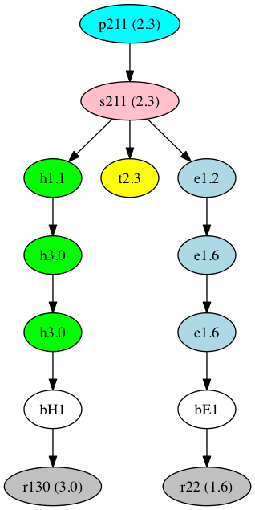

# FCC Directed Acyclic Graph Tool (DAG)
The DAG tool supports traversal of a [Directed Acyclic Graph](https://en.wikipedia.org/wiki/Directed_acyclic_graph) (also known here as DAG).

The tool is implemented in C++ using a templated Node class alongside a visitor algorithm.
A Floodfill algorithm is also provided which groups together nodes which are connected and returns a vector which contains vectors of connected nodes.




## Installation

Download from github:
  https://github.com/HEP-FCC/dag

```bash
source init.sh
mkdir build
cd build
cmake -DCMAKE_INSTALL_PREFIX=../install ..
make install
tests/tests
```

optional arguments:
 * -Ddag_documentation=ON (defaults to OFF)
 * -Ddag_example=ON (defaults to OFF)

For Xcode project use: cmake -G Xcode ..

## Implementation details

### Nodes

The Node class is templated,  Node\<T\> where T is intended to be either an identifier or the item of interest.
The Node class may not be const, but the thing it contains (T) may be set to be a const object

Nodes may contain
 * simple structures such as an int, long or pair
 * polymorphic classes ( T is set to &Base of the Base class)
 * Boost:Any  which allows direct insertion into the Nodes of any mixed set of class items
	  here T= const Boost::Any&

### Directed Acyclic Graph

Nodes may have multiple children and /or multiple parents.
A search may be for children, parents or undirected links.
An undirected search finds all nodes that are connected to the start node(s).

New visiting algorithms can be created by the user by deriving from the Visitor class interface ([BFSVisitor](https://github.com/HEP-FCC/dag/blob/master/dag/dag/DirectedAcyclicGraph.h#L119) is an example of this.)

## Example usage

### Standalone
```c++
typedef DAG::Node<const int> INode;
INode n0(0);
INode n1(1);
INode n2(2);
// and now define the dag
n0.addChild(n1);  // link between n0 and n1
n0.addChild(n2);  // link between n0 and n2 etc
// Start at node 0
DAG::BFSVisitor<INode> bfs;
for (auto n : bfs.traverseChildren(n0)) {
int id = n->value();
std::cout << "Node: " << n->value()  << std::endl;
}
```

Examples are provided for the following cases
 1. T is an integer identifier (T is set to a const int identifier)
 2. T is a pair
 3. Polymorphic classes.
 	T is set to be const &Base and the nodes include Base and Middle (derives from Base) instances.
 	Note that &Base is used for T in order to avoid copying the classes and in order that polymorphism is available

The examples can be installed by setting the optional CMake flag:-
cmake -DCMAKE_INSTALL_PREFIX=../install  -Ddag_example=ON ..

### Use with fcc-edm
For an example of fcc-edm that can build the DAG from EDM particles using an installation of the DAG header see
https://github.com/jlingema/fcc-edm/blob/graph/utilities/ParticleGraph.h
